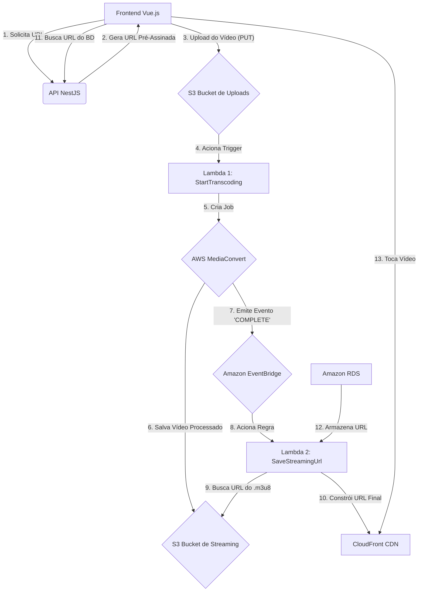

# Movie Service API

API robusta para gerenciamento e streaming de conteúdo de vídeo, construída com NestJS e seguindo os princípios da Arquitetura Limpa (Clean Architecture).

##

Este projeto é construído seguindo os princípios da **Arquitetura Limpa (Clean Architecture)** e do **Domain-Driven Design (DDD)**, garantindo uma clara separação de responsabilidades, alta testabilidade e manutenibilidade.

A separação de responsabilidades é alcançada com o padrão **CQRS (Command Query Responsibility Segregation)**, dividindo as operações de escrita (Commands) e leitura (Queries) para otimizar e escalar cada fluxo de forma independente.

A estrutura de pastas reflete essas escolhas arquiteturais:

  - **`src/`**
      - **`application/`**: Camada de Aplicação. Orquestra os casos de uso da aplicação.
          - `commands/`: Lógica para operações de escrita (Criação, Atualização, Deleção).
          - `queries/`: Lógica para operações de leitura (Busca de dados).
          - `dtos/`: Data Transfer Objects para comunicação entre camadas.
      - **`domain/`**: Camada de Domínio. Contém a lógica de negócio principal, entidades de domínio e regras que são independentes de qualquer tecnologia externa.
      - **`infrastructure/`**: Camada de Infraestrutura. Contém as implementações concretas de tecnologias externas.
          - `http/`: Lógica relacionada ao protocolo HTTP (Guards, etc).
          - `observability/`: Configuração de OpenTelemetry para tracing com Jaeger.
          - `persistence/`: Lógica de persistência de dados (Repositórios, Entidades de banco de dados).
          - `services/`: Integrações com serviços de terceiros (ex: AWS S3).
      - **`interfaces/`**: Camada de Interface. Ponto de entrada da aplicação.
          - `http/`: Controllers e DTOs específicos para as requisições HTTP.

## ✨ Recursos

  - CRUD completo para gerenciamento de filmes.
  - Upload de vídeos para o Amazon S3 usando URLs Pré-Assinadas.
  - Transcodificação de vídeo automática para streaming HLS com AWS Elemental MediaConvert.
  - Autenticação e autorização de rotas com JWT.
  - Observabilidade e tracing distribuído com **OpenTelemetry** e **Jaeger**.

## 🚀 Começando

Siga as instruções abaixo para configurar e rodar o projeto em seu ambiente de desenvolvimento.

### Pré-requisitos

  - Node.js (v18 ou superior)
  - NPM ou Yarn
  - Docker e Docker Compose
  - Uma conta AWS com credenciais configuradas

### Instalação

1.  Clone o repositório:

    ```bash
    git clone https://github.com/robyrt1/watch-movie-service.git
    ```

2.  Instale as dependências:

    ```bash
    npm install
    ```

3.  Configure as variáveis de ambiente. Crie um arquivo `.env` na raiz do projeto, baseado no `.env.example` (se houver).

    ```.env
    # Database
DATABASE_HOST=
DATABASE_PORT=5432
DATABASE_USERNAME=
DATABASE_PASSWORD=
DATABASE_NAME=

# JWT
JWT_SECRET=your_super_secret_jwt_key
JWT_EXPIRES_IN=1h

# Jaeger
JAEGER_AGENT_HOST=
JAEGER_AGENT_PORT=


# Rabbitmq
RABBITMQ_HOST=
RABBITMQ_PORT=
RABBITMQ_USER=
RABBITMQ_PASSWORD=
RABBITMQ_QUEUE=

# Tracing
OTEL_SERVICE_NAME=
    ```

### Rodando a Aplicação

1.  Rode a aplicação NestJS em modo de desenvolvimento:

    ```bash
    npm run start:dev
    ```

A aplicação estará disponível em `http://localhost:{port}}`.

## 🧪 Testes

Para rodar os testes unitários da aplicação, use o seguinte comando:

```bash
npm run test
```

## 📡 Endpoints da API

Abaixo estão os endpoints principais disponíveis nesta API, baseados na inicialização do serviço.

| Método | Rota                     | Descrição                                         |
| :----- | :----------------------- | :------------------------------------------------ |
| `POST` | `/movies`                | Cria um novo filme no banco de dados.             |
| `POST` | `/movies/upload-request` | Solicita uma URL pré-assinada para upload no S3.  |
| `GET`  | `/movies`                | Lista todos os filmes.                            |
| `GET`  | `/movies/:id`            | Busca um filme específico pelo seu ID.            |


Com certeza! Criar uma documentação clara do que foi construído é tão importante quanto a construção em si.

Aqui está um resumo detalhado, em formato de seção para o seu `README.md`, de toda a arquitetura da pipeline de vídeo que montamos na AWS, incluindo as configurações e o passo a passo da lógica.

---

## 🎥 Arquitetura da Pipeline de Vídeo na AWS

Este projeto implementa uma pipeline de processamento e streaming de vídeo serverless e escalável na AWS. O fluxo permite que um usuário envie um arquivo de vídeo bruto, que é automaticamente processado, otimizado para streaming adaptativo e distribuído globalmente através de uma CDN.

### Fluxo da Arquitetura

O processo completo pode ser visualizado no seguinte diagrama:



---

### ### Parte 1: Upload Seguro e Inteligente

Para evitar sobrecarga no backend com arquivos grandes, o upload é feito diretamente do cliente para a nuvem.

-   **Serviços:** Amazon S3, API NestJS
-   **Bucket S3 de Uploads:**
    -   **Nome:** `watch-brasil-movie-uploads` (exemplo)
    -   **Acesso Público:** **BLOQUEADO**.
    -   **Configuração de CORS:** Essencial para permitir que o navegador (frontend) envie o arquivo. A política deve permitir o método `PUT` da origem do seu frontend (ex: `http://localhost:5173`).
        ```json
        [
            {
                "AllowedHeaders": ["*"],
                "AllowedMethods": ["PUT"],
                "AllowedOrigins": ["http://localhost:5173"],
                "ExposeHeaders": []
            }
        ]
        ```
-   **Fluxo:** O frontend solicita uma **URL Pré-Assinada (Presigned URL)** para a API, que a gera usando o AWS SDK. O frontend então usa essa URL temporária e segura para fazer um `PUT` do arquivo de vídeo diretamente para o S3.

---

### ### Parte 2: Transcodificação Automática

Assim que o vídeo chega no S3, um processo serverless de transcodificação é iniciado.

-   **Serviços:** AWS Lambda, Amazon S3, AWS Elemental MediaConvert, IAM
-   **Bucket S3 de Streaming:**
    -   **Nome:** `watch-brasil-streaming-output` (exemplo)
    -   **Acesso:** Inicialmente privado. O acesso será concedido apenas ao CloudFront.
-   **MediaConvert:** Um **Modelo de Trabalho (Job Template)** é pré-configurado para converter o vídeo para o formato HLS com múltiplas qualidades (ex: 1080p, 720p, 360p).
-   **Lambda 1 (`start-video-transcoding`):**
    -   **Gatilho:** Acionada por eventos `s3:ObjectCreated:*` no bucket de uploads.
    -   **Função:** Inicia um novo trabalho no MediaConvert usando o template pré-configurado.
    -   **Permissões (IAM Role):** Precisa de permissão para `mediaconvert:CreateJob` e, crucialmente, `iam:PassRole` para poder "entregar" uma role com acesso ao S3 para o MediaConvert.

---

### ### Parte 3: Captura da URL Final

Após o MediaConvert terminar seu trabalho, um evento é emitido e capturado para que a URL final do vídeo seja processada.

-   **Serviços:** Amazon EventBridge, AWS Lambda
-   **EventBridge:** Uma **Regra (Rule)** é configurada para monitorar os eventos do MediaConvert.
    -   **Padrão de Evento:** A regra é acionada especificamente por eventos `MediaConvert Job State Change` onde o `"status"` é `COMPLETE`.
-   **Lambda 2 (`save-streaming-url`):**
    -   **Gatilho:** A regra do EventBridge acima.
    -   **Função:** Parseia o evento recebido, extrai o caminho do arquivo de manifesto principal (`.m3u8`) e o utiliza para o próximo passo.

---

### ### Parte 4: Distribuição Global com CDN

Para garantir a entrega de baixa latência e alta performance, os vídeos são servidos através da CDN Amazon CloudFront.

-   **Serviços:** Amazon CloudFront, Amazon S3
-   **Configuração da Distribuição:**
    -   **Origem (Origin):** O bucket `watch-brasil-streaming-output`.
    -   **Acesso à Origem (Origin Access):** Configurado com **Origin Access Control (OAC)**. Isso mantém o bucket S3 privado. Uma política de bucket é gerada pelo CloudFront e deve ser aplicada ao bucket S3 para conceder permissão de leitura exclusivamente à distribuição.
    -   **Comportamento de Cache (Cache Behavior):**
        -   **Política de Requisição de Origem:** Definida como **`CORS-S3Origin`**. Este é um passo **crítico** para permitir que o player HLS.js no navegador funcione corretamente.
    -   **Configuração de CORS no Bucket S3:** O bucket `watch-brasil-streaming-output` deve ter uma política CORS que permita o método `GET` da origem do frontend.
        ```json
        [
            {
                "AllowedHeaders": ["*"],
                "AllowedMethods": ["GET", "HEAD"],
                "AllowedOrigins": ["http://localhost:5173"],
                "ExposeHeaders": []
            }
        ]
        ```
    -   **Invalidação:** Após qualquer alteração na configuração CORS do S3, uma invalidação de cache no CloudFront (`/*`) é necessária para forçar a atualização.

---

### ### Parte 5: Persistência e Integração com a API

A URL final de streaming é salva no banco de dados para ser consumida pela aplicação.

-   **Serviços:** Amazon RDS, AWS Secrets Manager, AWS Lambda, VPC
-   **Banco de Dados:** Uma instância **PostgreSQL** é criada no **Amazon RDS**, configurada para **não ter acesso público**.
-   **Segurança de Rede:**
    -   Tanto a instância RDS quanto a Lambda `save-streaming-url` residem na mesma **VPC**.
    -   São usados dois **Grupos de Segurança (Security Groups)**:
        1.  `rds-security-group`: Permite tráfego de entrada na porta `5432` apenas se a origem for o `lambda-security-group`.
        2.  `lambda-security-group`: Associado à função Lambda.
-   **Gerenciamento de Segredos:** As credenciais do banco de dados (usuário, senha, host) são armazenadas de forma segura no **AWS Secrets Manager**.
-   **Lógica Final da Lambda 2:** A função `save-streaming-url` é atualizada para:
    1.  Buscar as credenciais do Secrets Manager.
    2.  Conectar-se à instância RDS.
    3.  Construir a URL final de streaming (`https://<dominio_cloudfront>/<caminho_do_manifesto.m3u8>`).
    4.  Salvar essa URL na tabela de filmes do banco de dados, associada ao filme correto.

## 🛠️ Tecnologias Utilizadas

  - **Backend:** NestJS, TypeScript
  - **Banco de Dados:** PostgreSQL, TypeORM
  - **Autenticação:** Passport.js, JWT
  - **Cloud:** AWS S3, AWS Elemental MediaConvert, AWS Lambda, Amazon RDS
  - **Observabilidade:** OpenTelemetry, Jaeger
